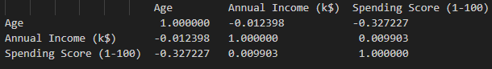

# 데이터 전처리
1. 결측치 없음. 
2. outlier 처리 x 
3. 특징 선택 -> 컬럼 역할 하는 customer_ID와 이미 분류 역할을 하는 gender 컬럼 제외한 3개 컬럼 사용. 

# 클러스터링 기법 적용. 
k-mean, 계층적 군집화, DBSCAN, GaussianMixture 4개 사용.

# 클러스터 수 결정. 
k-mean은 엘보우 방법, 나머지는 실루엣 점수를 기반으로 클러스터 수 결정. 실루엣 점수가 가장 좋은 조건에서 하이퍼 파라미터를 결정함. 

# 결과 시각화
3차원 산포도로 시각화를 진행함. 

# 클러스터링 기법 비교. 
Kmeans_Silhouette Score : 0.40846873777345605 # k_mean   
AC_Silhouette Score     : 0.4201169558789579  # 계층적 군집화   
DBSCAN_Silhouette Score : 0.11395369330062792 # DBSCAN   
GMM_Silhouette Score    : 0.3999977925024676  # GaussianMixture   

따라서 계층적 군지화가 가장 클러스터링 성능이 좋다고 판단 가능하다. 

# 예측모델 

각 특징간의 상관관계가 부족하여 예측 모델을 구성할 데이터라고 보긴 어렵다. 

# 시계열 분석
시계열 관련된 정보가 존재하지 않아 시계열 분석이 불가능함. 
