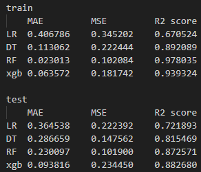

# 데이터 전처리
1. 결측치 처리 - CRIM, INDUS, AGE는 평균값으로 결측값을 대체, ZN, CHAS는 결측값을 0으로 대체.
 LSTAT는 상관관계가 높아 임의로 입력시 오류가 클 수 있다. 따라서 해당 LSTAT가 결측값인 행은 제외하고 학습을 진행. 
2. outlier 처리 - IQR 방식으로 경계값 설정. 경계값 밖의 데이터는 경계값으로 수정. 처리한 컬럼은 'ZN','RM','DIS', 'LSTAT' 이 외의 데이터는 학습에 영향이 적어 outlier 처리를 진행하지 않음. 
3. 특징 선택 - corr() 함수를 이용하여 컬럼간 상관관계 분석. 타겟값인 MEDV와 상관관계가 0.4이상인 컬럼만 학습에 사용. 일반적으로 유의미한 상관관계는 0.5 이상이나, 이 경우 특징 수가 너무 적어지는 문제가 발생하여 0.4로 수정하여 사용. 

# 회귀 모델
LinearRegression, DecisionTreeRegressor, RandomForestRegressor, XGBRegressor를 사용. 

# 모델 성능 평가. #이미지 첨부

train 결과값을 기준으로 학습 수준을 판단, test 결과값을 기반으로 모델 성능을 판단. 모델 성능은 XGB 모델이 가장 성능이 좋다는 것을 보여주고 있음. RandomForestRegressor의 경우 train 데이터에 대해서 MAE,MSE, R2 모드 수치가 높지만, test 데이터에 대해서는 XGB와 비슷하거나 낮다. 따라서 RandomForestRegressor는 과적합이 심한 상황이라고 판단 가능하다. 

# 모델 앙상블. 
RandomForestRegressor과 XGBRegressor는 각각 배깅과 부스팅 기반의 모델이다. 따라서 모델 앙상블 수행하였음. 

# 하이퍼 파라미터 튜닝. 
grid search 방법을 이용하여 하이퍼 파라미터 튜닝을 진행함. 

# 시간적 추가요소. 
시간에 관계된 정보가 존재하지 않아 시간적 추가요소를 추가할 수 없음. 제대로된 분석 없이 시간적 요소를 추가할 경우 오히려 모델의 성능을 심각하게 저해시킬 것이라고 판단함. 
